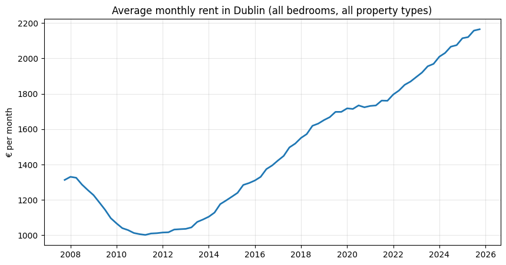
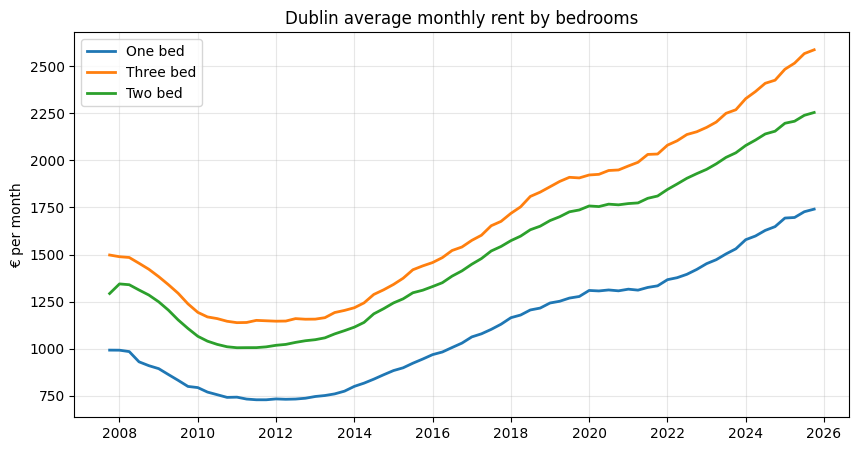
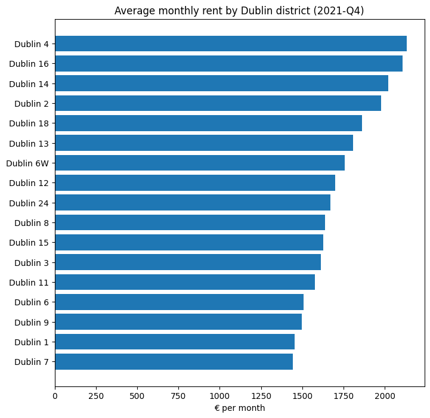
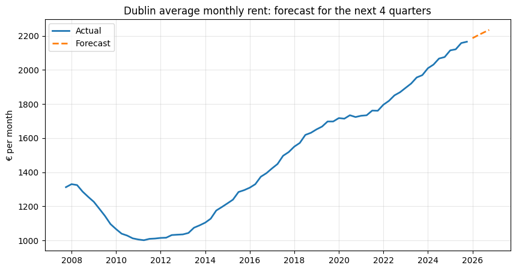
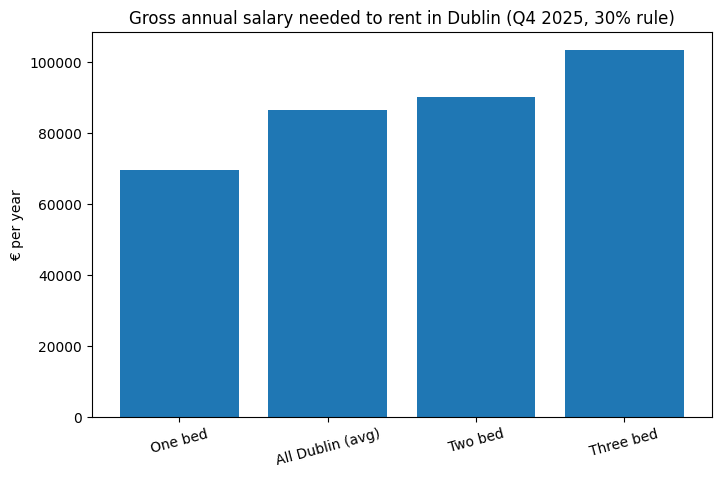

# Dublin Rent Analysis & Forecast

How have Dublin rents changed since 2007, which areas cost the most, what could rents look like next year, and what salary do you need to afford them?

## Data
Residential Tenancies Board (RTB) Average Monthly Rent Report, table RIQ02, published by the Central Statistics Office (CSO) under CC BY 4.0, accessed via [DBnomics](https://db.nomics.world/CSO/RIQ02).
- 7,014 Dublin series (by area, bedrooms and property type), about 512,000 records
- Quarterly, 2007-Q4 to 2025-Q4
- District-level (Dublin 1-24) data ends in 2021; only the Dublin-wide series runs to 2025
- Values are nominal euros per month (not adjusted for inflation)

The notebook downloads the data automatically, so no data file is needed.

## Key Findings
| Metric | Result |
|---|---|
| Average Dublin rent, Q4 2025 | €2,165 per month |
| Change vs 1 year ago | +4.3% |
| Change vs 5 years ago | +25.6% |
| Change since Q4 2007 | +64.9% |
| Low point | Q2 2011, €1,002 |
| Rise from the 2011 low to Q4 2025 | about +116% |

### Rent by bedrooms (Q4 2025)
| Type | Average monthly rent |
|---|---|
| One bed | €1,741 |
| Two bed | €2,253 |
| Three bed | €2,586 |

### Rent by district (2021-Q3, latest quarter with all 21 districts)
- Most expensive: Dublin 4 (€2,176), Dublin 14 (€2,124), Dublin 16 (€2,077)
- Cheapest: Dublin 10 (€1,462), Dublin 7 (€1,464), Dublin 1 (€1,544)
- Dublin 4 was about 49% (€714 a month) more expensive than Dublin 10

## Forecast
Damped-trend exponential smoothing (Holt-Winters) on the Dublin-wide series.

- **Backtest:** trained on data up to 2023-Q4 and predicted the last 8 quarters, with a mean absolute percentage error of 1.5%.
- The model under-predicted in all 8 quarters, with the gap growing to about 2% by the 8th, so the forecast is best read as **conservative**.

| Quarter | Forecast average rent |
|---|---|
| 2026-Q1 | €2,186 |
| 2026-Q2 | €2,203 |
| 2026-Q3 | €2,219 |
| 2026-Q4 | €2,234 |

## Affordability
Assumption: rent should be no more than 30% of gross income (a common rule of thumb, not an official threshold).

| Type (Q4 2025) | Monthly rent | Gross salary needed per year |
|---|---|---|
| One bed | €1,741 | about €69,600 |
| All Dublin (average) | €2,165 | about €86,600 |
| Two bed | €2,253 | about €90,100 |
| Three bed | €2,586 | about €103,400 |

**Illustrative district estimate:** assuming each district's rent relative to the Dublin average is unchanged since 2021-Q3, Dublin 4 would need roughly €107,000 a year and Dublin 10 or Dublin 7 roughly €72,000. This is an assumption applied to old data, not a measured result.

## Limitations
- District-level data stops in 2021, so district figures are estimates
- Averages hide differences between individual properties and listing vs. existing tenancies
- Forecast uses only past rents (no wages, supply or policy changes) and covers 4 quarters
- Figures are not adjusted for inflation

## Tools
Python, pandas, statsmodels, matplotlib, Google Colab

## Author
Harshitha Shankar | MSc Business Analytics, UCD Smurfit School of Business
[LinkedIn](https://linkedin.com/in/harshithashankar14)
